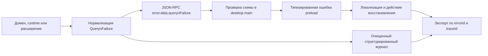

# Ошибки, журналы и диагностика

Страница разворачивает [ADR 0018](../adr/adr-0018-errors-and-diagnostics.md) в
сквозную модель desktop, runtime, процессов расширений и проектного ядра.

## Цели

Пользователь должен понимать, что произошло, сохранены ли его данные и как
продолжить. Разработчик должен связать событие между процессами по одному
идентификатору. Диагностика не должна требовать постоянного сбора содержимого
проекта или показа необработанного технического вывода.

## Три разных объекта

| Объект | Назначение | Получатель |
| --- | --- | --- |
| Пользовательская ошибка | Объяснение и восстановление | Пользователь |
| Структурированный журнал | Хронология работы и сбоя | Поддержка и разработчик |
| Диагностический пакет | Отобранный переносимый снимок | Пользователь и поддержка |

Эти объекты связаны `errorId` и `traceId`, но не заменяют друг друга. Журнал не
показывается как пользовательское сообщение. Пользовательская ошибка не
содержит полный стек. Экспорт не копирует все локальные журналы без отбора.

## Поток ошибки



Первый слой, который понимает доменную причину, назначает `code`. Последующие
слои сохраняют `code`, `errorId` и `traceId`. Они добавляют связанные события,
но не создают новый идентификатор трассировки. Неожиданное исключение
нормализуется на границе компонента в `INTERNAL_UNEXPECTED`.

`errorId` уникален для одного факта ошибки и используется как номер поддержки.
`traceId` создаётся для пользовательского действия, задания или запуска runtime
и объединяет последовательность событий между процессами.

Host передаёт `traceId` процессному или удалённому runtime в параметрах
протокольного вызова. Сторонний runtime может возвращать этот идентификатор в
`logs/event`, но не создаёт новый Queryn `errorId`. Host назначает `errorId`
после проверки и нормализации стороннего сбоя.

## Отображение в JSON-RPC

Зарезервированные числовые коды JSON-RPC сохраняют стандартное значение для
ошибок разбора, неверного запроса и отсутствующего метода. Доменные ошибки Queryn
используют выделенный application range, а `QuerynFailure` помещается в
`error.data.querynFailure`. Клиент сначала проверяет транспортный код, затем
валидирует вложенный конверт. Неизвестные и лишние поля удаляются до IPC.

## Реестр кодов

Публичные коды хранятся рядом со схемой в `queryn-spec`. Для каждого кода
указываются категория, допустимость повтора, допустимые типы восстановления,
схема безопасных параметров и владелец. Удаление опубликованного кода требует новой версии
контракта. Текст локализации может меняться без смены кода.

Категория задаёт общую форму поведения:

| Категория | Обычное поведение |
| --- | --- |
| `validation` | Подсветить неверный ввод и не выполнять действие |
| `not-found` | Обновить состояние и предложить выбрать существующий объект |
| `conflict` | Сохранить локальные данные и запросить разрешение конфликта |
| `permission` | Объяснить требуемое разрешение и получателя |
| `compatibility` | Показать поддержанную версию или платформу |
| `dependency` | Предложить подготовку или другой поставщик |
| `resource` | Показать нарушенный лимит и безопасный fallback |
| `timeout` | Предложить повтор только при безопасной семантике |
| `external` | Назвать сторонний компонент и сохранить локальную работу |
| `internal` | Дать номер ошибки, восстановление и экспорт диагностики |

Пользовательская отмена является статусом операции или задания. Она не создаёт
`QuerynFailure`, если сама отмена завершилась штатно.

## Публичные асинхронные состояния

`JobDescriptor`, `RuntimeState` и состояние агентного запуска содержат
`failure?: QuerynFailure`. Строковое поле `error` остаётся только для чтения
ранее сохранённых производных записей. Runtime преобразует его при загрузке и
записывает новые состояния уже со структурированной причиной.

Миграция не меняет файлы проекта. Записи jobs находятся в локальных данных
runtime и могут быть пересозданы. Событие `job.changed` передаёт тот же
`failure`, который сохранён в состоянии задания, без повторного создания
`errorId`.

## Формирование пользовательского текста

Runtime возвращает безопасный английский или нейтральный fallback `message`.
Desktop выбирает локализованный шаблон по `code` и подставляет только поля,
разрешённые схемой. Имя файла, расширения или поставщика может отображаться,
если оно уже видно пользователю. Абсолютный путь, endpoint с credentials и
необработанный ответ сервера не подставляются.

Хорошее сообщение содержит результат, сохранность и действие. Например:

> PDF не удалось разобрать. Файл не изменён. Можно открыть его системным
> приложением или повторить чтение. Номер ошибки: 7N4K2.

Номер в интерфейсе является коротким представлением `errorId`. Полный
идентификатор остаётся в диагностическом пакете.

Доступные действия восстановления вычисляет доверенный host. Реестр кодов
описывает допустимые типы действий, а текущие разрешения, состояние файла,
идемпотентность и доступность runtime определяют, какие кнопки можно показать.
Сторонний процесс не передаёт исполняемое действие в конверте ошибки.

## Структурированные события

Базовая запись журнала содержит:

```json
{
  "timestamp": "2026-08-29T10:15:30.000Z",
  "level": "error",
  "component": "runtime.supervisor",
  "event": "runtime.handshake.failed",
  "errorId": "...",
  "traceId": "...",
  "extensionId": "queryn.example.tool",
  "runtimeId": "queryn.example.tool.runtime",
  "code": "RUNTIME_HANDSHAKE_FAILED"
}
```

Имена событий стабильны и не являются свободным сообщением. `traceId` обязателен
для событий внутри пользовательского действия, а `errorId` присутствует только
при связи с конкретной ошибкой. Дополнительные поля проверяются по allowlist
компонента. Высокочастотный прогресс агрегируется, чтобы не переполнять журнал.

### Уровни

- `error` означает завершённое неуспехом действие или потерю возможности
- `warn` означает деградацию, восстановление или риск будущего сбоя
- `info` означает редкое значимое изменение жизненного цикла
- `debug` используется во временной диагностике и разработке
- `trace` допускается только для узкого воспроизведения с жёстким сроком

Обычный успешный рендер кадра, каждый прочитанный фрагмент и каждый токен
модели не журналируются как `info`.

## Очистка данных

Очистка выполняется до записи на диск. Она централизована и покрывается
тестами. Ключи `token`, `secret`, `password`, `authorization`, `cookie` и
credentials удаляются независимо от регистра. URL очищается от userinfo и
чувствительных query-параметров. Абсолютные пути проекта заменяются project id
и относительным путём только там, где он необходим.

Строка от стороннего процесса ограничивается по размеру и числу строк. stdout
протокола не журналируется целиком. stderr хранится отдельным событием с
`source: third-party`, версией расширения и признаком усечения. Он никогда не
добавляется к `message` пользовательской ошибки.

## Хранение и ротация

Desktop и runtime пишут журналы в данные приложения, а не в папку проекта.
Каждый процесс использует JSON Lines или эквивалентный потоковый формат.
Ротация ограничивает размер отдельного файла и общий бюджет. Старые файлы
удаляются по сроку и бюджету. Крэш не должен повреждать все предыдущие записи.

Точные значения бюджета являются настройкой поставки. Начальная рекомендация:
до 20 МБ на файл, до пяти файлов на компонент и до четырнадцати дней хранения.
Расширенная диагностика имеет отдельный меньший срок и удаляется автоматически.

## Временная расширенная диагностика

Пользователь выбирает область и длительность. Примеры областей:

- запуск одного расширения
- открытие одного материала
- подключение к runtime
- один запрос к поставщику модели без содержимого запроса
- восстановление после перезапуска

Режим показывает обратный отсчёт и видимый признак активности. После завершения
предлагается экспортировать или удалить собранное. Перезапуск не должен
случайно оставлять бессрочный расширенный сбор.

В разработке уровни `debug` и `trace` могут включаться параметром запуска. Это
не отменяет очистку секретов и не меняет публичный конверт ошибок.

## Диагностический пакет

Пакет имеет собственный `diagnostics-manifest.json` с версией формата, временем,
выбранной областью, применёнными правилами очистки и перечнем файлов. Перед
сохранением интерфейс показывает категории данных. После сохранения Queryn не
отправляет архив автоматически.

Рекомендуемая структура:

```text
queryn-diagnostics/
├── diagnostics-manifest.json
├── application.json
├── capabilities.json
├── extensions.json
├── errors.jsonl
├── desktop-events.jsonl
└── runtime-events.jsonl
```

Содержимое проекта, дамп сессии и ввод модели могут добавляться только как
отдельные явно выбранные вложения. Их отсутствие не должно ухудшать базовую
проверку совместимости, handshake, разрешений и жизненного цикла задания.

## Наблюдаемость восстановления

При запуске runtime фиксирует обнаружение незавершённого задания, перевод в
`interrupted`, возможность безопасного повтора и результат очистки временных
каталогов. Desktop фиксирует аварийное завершение runtime, число попыток
перезапуска и окончательную деградацию. Автоматический цикл перезапуска имеет
верхнюю границу и паузу.

Публикация артефакта связывает staging, проверку и атомарную замену одним
`traceId`. Конкретный сбой получает отдельный `errorId`. Это позволяет доказать,
что ошибка parser process не привела к частично опубликованному результату.

## Последовательность внедрения

1. Зафиксировать `QuerynFailure`, реестр кодов и диапазон application errors в
   `queryn-spec`.
2. Добавить `failure` в Job Descriptor и правила чтения старого `error`.
3. Добавить фабрики, `errorId`, `traceId` и нормализацию в `queryn-core`.
4. Передавать конверт через runtime RPC и типизированный preload.
5. Перевести runtime states, агентный запуск, просмотрщик и расширения на коды.
6. Ввести общий JSON logger, корреляцию, очистку, ротацию и ограничение stderr.
7. Заменить сырой JSON диагностики desktop на состояние здоровья и действия.
8. Добавить временную диагностику и прозрачный экспорт.
9. Покрыть очистку тестами с секретами, путями и вредоносным выводом расширения.

## Оценка объёма

Начальный сквозной слой для наиболее важных ошибок требует от двух до четырёх
инженерных недель. Централизованные журналы, ротация и корреляция добавляют от
двух до трёх недель. Пользовательский экспорт и временная диагностика добавляют
от двух до четырёх недель. Полная миграция всех строковых исключений будет идти
постепенно и не должна блокировать выпуск первой полезной версии.
