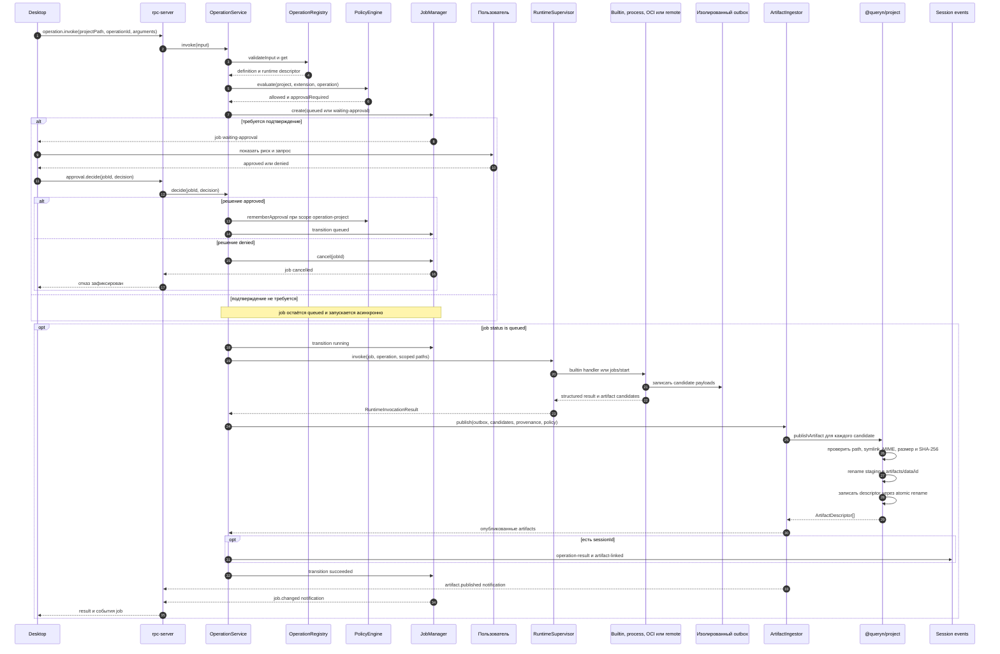
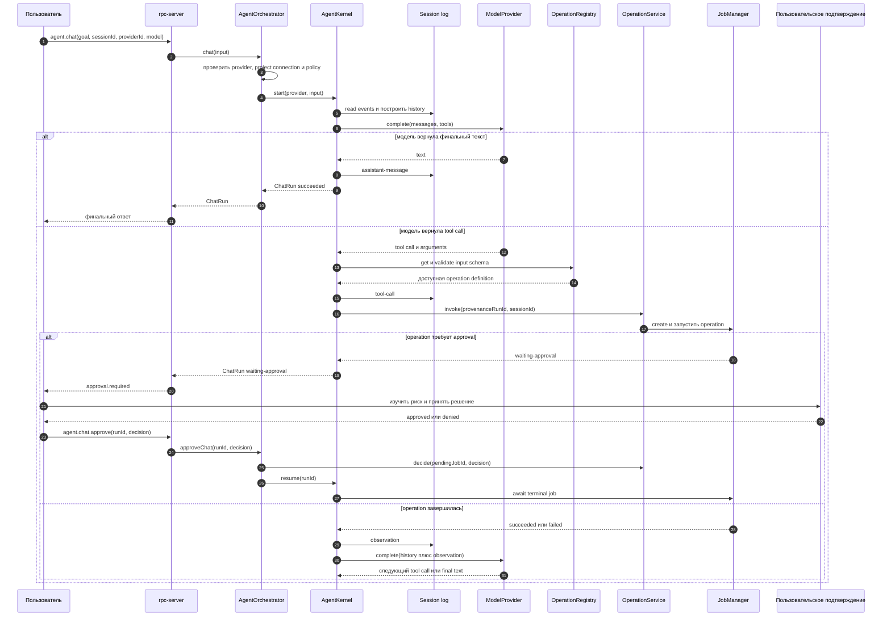
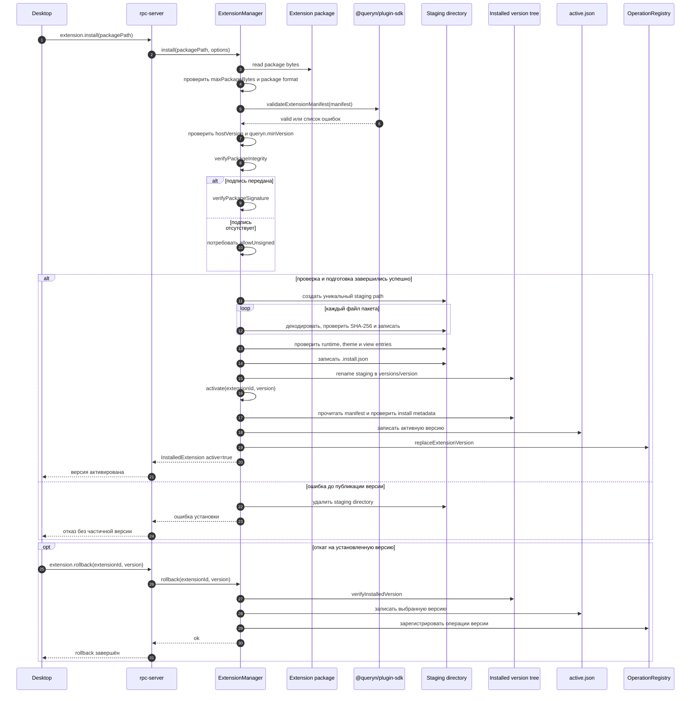
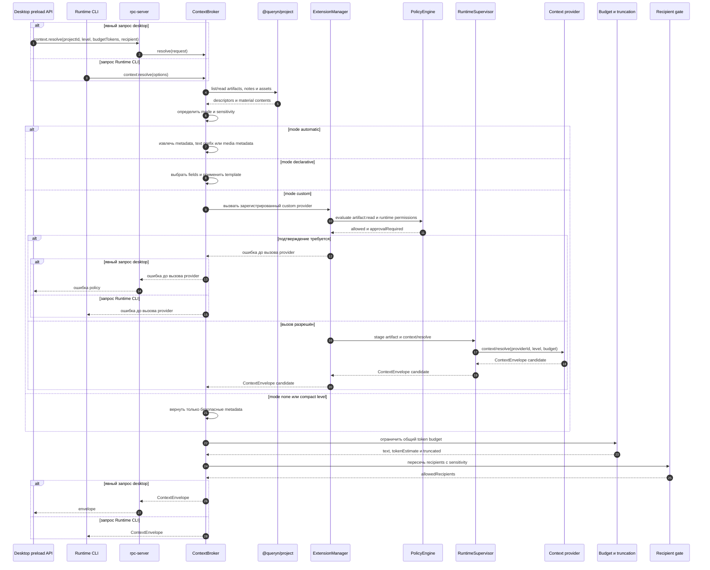
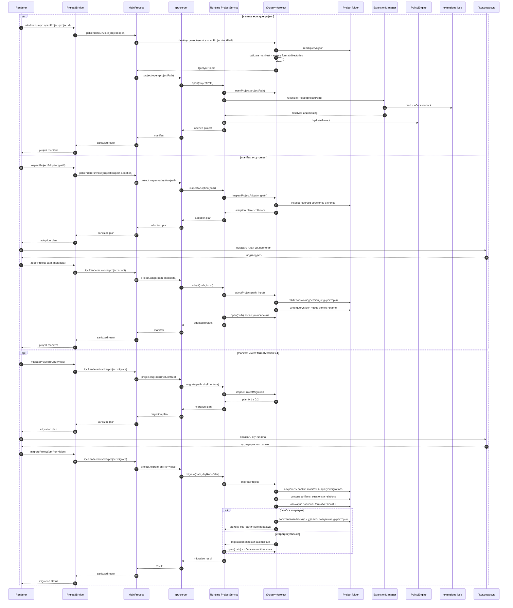
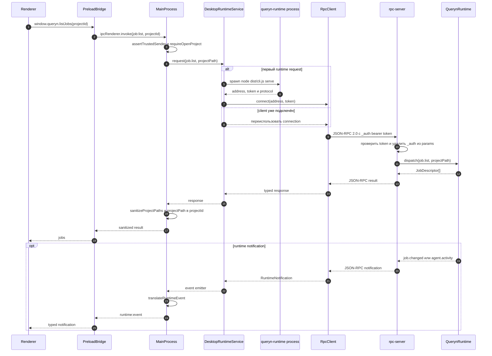

# Архитектурные потоки

Ниже зафиксированы шесть последовательностей, которые уже поддерживаются
исходниками. Диаграммы показывают реальные границы runtime, core и Electron,
а не будущие пользовательские сценарии. Mermaid является каноническим
форматом диаграмм.

| Поток | Основные точки реализации |
| --- | --- |
| Выполнение операции | `queryn-runtime/src/operation-service.ts`, `job-manager.ts`, `runtime-supervisor.ts`, `artifact-ingestor.ts` |
| Агентный tool loop | `agent-orchestrator.ts`, `agent-kernel.ts`, `operation-service.ts` |
| Установка расширения | `extension-manager.ts`, `@queryn/plugin-sdk` |
| Context envelope | `context-broker.ts`, `extension-manager.ts` для custom provider |
| Открытие, усыновление и миграция | `project-service.ts`, `@queryn/project` |
| Desktop IPC | `preload/index.ts`, `main/index.ts`, `main/services/runtime-service.ts`, `rpc-server.ts` |

## 1. Выполнение операции {#operation-execution}

Операция всегда проходит через `OperationService`. До запуска проверяются
схема входа, artifact inputs, permissions и risk. При необходимости job
останавливается в `waiting-approval`. Внешний runtime получает только
материализованные inputs и пишет кандидатов в изолированный outbox.

Если `publishArtifacts` отключён, `OperationService` сохраняет кандидатов в
`pending-artifacts` и оставляет job ожидающим публикации. Вызов
`artifact.publish` повторно передаёт выбранные кандидаты `ArtifactIngestor`,
после чего записываются результат сессии и успешный статус job. Команда CLI
`operation:invoke` вызывает тот же `OperationService` напрямую и ждёт terminal
статус без участия `rpc-server`.

## 2. Агентный tool loop {#agent-tool-loop}

`AgentOrchestrator` авторизует выбранный model provider и передаёт управление
`AgentKernel`. Kernel читает session log, предлагает модели только доступные
операции, записывает видимый вызов инструмента и добавляет observation после
terminal job. Подтверждение приостанавливает run и не повторяет вызов до
явного resume.

После observation цикл возвращается к `Provider`, пока модель не вернёт текст,
не исчерпает `maxSteps` или не будет отменена. Сохраняются только видимые
события сессии, hidden model reasoning в проект не записывается.

## 3. Установка и откат расширения {#extension-installation}

Установка не активирует непроверенное дерево файлов. `ExtensionManager`
ограничивает размер пакета, проверяет manifest и host compatibility, integrity
и подпись, разворачивает файлы в уникальный staging path, а затем одним rename
публикует immutable version tree. Откат выбирает уже установленную версию и
повторно выполняет проверку install metadata перед активацией.

Иммунитет версии обеспечивается `integrity` из `.install.json`. Подключение к
проекту выполняется отдельной операцией: она добавляет требование в
`queryn.json`, обновляет `.queryn/extensions/lock.json` и выдаёт локальные
grants через `PolicyEngine`. CLI-команды `extension:install` и
`extension:rollback` вызывают `ExtensionManager` напрямую, без `rpc-server`.

## 4. Context envelope {#context-envelope}

`ContextBroker` разрешает материалы по их context policy, чувствительности,
уровню детализации и бюджету. Для `custom` provider перед вызовом runtime
проверяются permissions и risk. `RecipientGate` на диаграмме является частью
этой логики broker, а не отдельным исполняемым сервисом.

Текущий `SessionWorkspace` при открытии окружения вызывает `context.preview` и
показывает компактный каталог. Полный `context.resolve` доступен через
preload API и CLI, но не вызывается из `agent.chat`, ниже показан именно этот
явный путь разрешения envelope.

Встроенные режимы возвращают envelope с `providerVersion` вида
`host.automatic/1`, `host.declarative/1` или `host.metadata/1`. Если материал
помечен sensitive, допустимым получателем остаётся только `local`. Индекс
поиска строится отдельно в `.queryn/index` и не становится содержимым
переносимого контракта.

## 5. Открытие, усыновление и миграция проекта {#project-lifecycle}

Открытие проекта сначала читает manifest и проверяет структуру. Усыновление
незнакомой папки сначала возвращает план с отсутствующими директориями и
коллизиями, а затем по подтверждению создаёт только недостающие пути и пишет
новый manifest. Формат `0.1` не меняется при обычном открытии и переводится в
`0.2` только отдельной миграцией.

В `queryn-core/packages/project/src/project.ts` чтение manifest также создаёт
только служебные директории, необходимые объявленной версии. В
`migration.ts` исходный manifest сохраняется до изменения, а ошибка восстанавливает
его байты и удаляет каталоги, созданные в рамках этой миграции.

## 6. Desktop IPC и local RPC {#desktop-ipc}

Renderer вызывает только типизированный `window.queryn`. Main process проверяет
доверенный frame, переводит идентификатор проекта в канонический путь и
санитизирует ответ. `DesktopRuntimeService` лениво запускает runtime, а
`RpcClient` добавляет bearer token к каждой JSON-RPC строке.

Для файловых операций main process использует `project-service.ts` и
`file-service.ts` напрямую, без обхода через runtime. Для runtime-операций
канон транспортного уровня остаётся `queryn-rpc/1`, а события передаются по
тому же локальному соединению.
