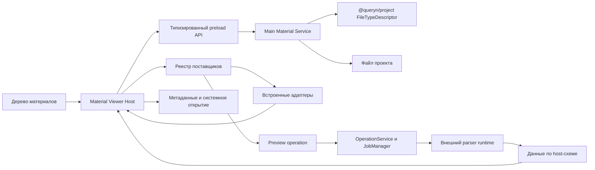

# Архитектура просмотрщика материалов

Страница разворачивает [ADR 0017](../adr/adr-0017-material-viewer-host.md) и
определяет просмотрщик как основной шлюз изучения проекта. Пользователь должен
уметь открыть материал, понять его содержание, найти нужное место, выполнить
безопасное базовое действие и продолжить работу при любой ошибке адаптера.

## Продуктовая граница

Просмотрщик не является облегчённой IDE, офисным пакетом или универсальной
средой выполнения. Его задача состоит в том, чтобы сделать обычные файлы
понятными внутри контекста проекта. Базовая правка поддерживается там, где
Queryn может гарантировать предсказуемое сохранение исходного текста.

Встроенный слой должен быть полезен сам по себе. Расширение повышает точность,
добавляет специализированное представление или безопасную операцию. Удаление
расширения не делает файл недоступным.

## Компонентная модель

### `@queryn/project`

Ядро определяет `FileTypeDescriptor` и чистую функцию классификации. Main
process передаёт ей нормализованный `FileTypeEvidence`: имя, расширение,
заявленный и обнаруженный MIME, категорию сигнатуры и текстовую или бинарную
природу. Результат содержит тип, семейство представления, возможности,
уверенность и несовпадение признаков.

Ядро не возвращает renderer абсолютный путь и не владеет состоянием вкладки.
Размер, версия файла, кодировка и разрешённые действия входят в desktop-контракт
`MaterialDescriptor`.

### Main Material Service

Main process принимает `projectId`, относительный путь и ограниченную операцию.
Он проверяет границу проекта и возвращает только типизированные данные. Сервис
читает фрагменты, создаёт безопасный resource handle, вызывает встроенный parser
или operation поставщика и сохраняет поддержанный текст атомарно. Renderer не
получает Node.js API и абсолютные пути.

Resource handle является непрозрачной capability. Он привязан к одному файлу и
его версии, разрешённому MIME, диапазонам байтов, суммарному бюджету чтения и
короткому сроку жизни. Handle отзывается при закрытии материала, изменении файла
или завершении окна.

### Material Viewer Host

Host хранит состояние выбранного материала, поставщика, поиска, навигации,
масштаба и несохранённой правки. Он отрисовывает загрузку, пустой файл,
усечение, ошибку, конфликт и fallback единообразно. Адаптер не создаёт
собственную оболочку этих состояний.

### Реестр поставщиков

Реестр получает канонический дескриптор и список доступных поставщиков. Он
выбирает поставщика детерминированно. Встроенный адаптер имеет известный
приоритет. Сторонний поставщик может превзойти его только при достаточной
уверенности формата, совместимом контракте и готовом runtime.

## Поток открытия

1. Навигатор передаёт `projectId` и относительный путь.
2. Main process проверяет путь и получает метаданные без полного чтения.
3. Main собирает признаки, а ядро классифицирует материал.
4. Host выбирает совместимого поставщика и его режим доступа.
5. Сервис читает ограниченный фрагмент или создаёт resource handle.
6. Адаптер формирует представление или данные по host-схеме.
7. Ошибка переводится в структурированный код и приводит к безопасному
   запасному пути без потери навигации.

Повторное открытие может использовать кэш только при совпадении версии файла,
версии адаптера и параметров разбора. Кэш не считается источником истины.

## Формы данных между парсером и host

Предпочтение отдаётся ограниченному набору host-схем:

| Схема | Применение | Основные ограничения |
| --- | --- | --- |
| `text-document` | Текст и код | Кодировка, строки, признак усечения |
| `tree-document` | JSON, XML, YAML | Ограничение глубины и числа узлов |
| `table-document` | CSV, XLSX, Parquet | Схема, диапазон строк, общее число |
| `paged-document` | PDF, DOCX, PPTX | Число страниц, текстовые блоки, миниатюры |
| `image-document` | Растровые изображения и безопасный SVG | Размеры, цветовой профиль, ресурс |
| `notebook-document` | IPYNB | Ячейки и сохранённые результаты без исполнения |
| `metadata-only` | Неизвестный или опасный формат | Тип, размер, hash и внешнее открытие |

Схема обязана явно сообщать, является ли результат полным, усечённым,
приближённым или извлечённым. Это предотвращает ложное обещание точности.

## Контракт адаптера

Каждый встроенный адаптер объявляет входы, действия и ограничения. Минимальная
запись содержит `id`, версию, набор типов, приоритет, максимальный размер,
возможность потокового чтения, поддержанный поиск и стратегию fallback.

Адаптер не получает сервисы приложения напрямую. Он использует capability
объекты host. Текстовый адаптер может запросить следующий фрагмент. Табличный
адаптер может запросить диапазон строк. Страничный адаптер может запросить
конкретную страницу. Право чтения одного материала не означает право обхода
всего проекта.

## Правка и конфликт

Редактируемый документ хранит исходную версию, кодировку, окончания строк и
локальное содержимое. Сохранение передаёт ожидаемую версию файла. Main process
повторно проверяет путь и метаданные, записывает временный файл в том же
каталоге и выполняет атомарную замену.

Если версия изменилась, host получает `PROJECT_FILE_CHANGED`. Он не очищает
буфер. Пользователь может перечитать внешний вариант, сравнить доступный текст,
сохранить свою версию как новый файл или осознанно заменить исходник. Переход к
другому материалу при несохранённой правке требует явного решения.

## Большие и контейнерные форматы

Текст читается фрагментами с отдельной моделью строк. PDF и изображения
передаются через ограниченный ресурс, а не base64 в общем IPC-ответе. ZIP-based
Office и IPYNB разбираются в worker или процессе. Ограничиваются исходный
размер, число элементов, глубина, суммарный распакованный объём, время и память.

Парсер не извлекает архив в проект и не доверяет внутренним путям. Внешние
ссылки, сущности, шрифты и изображения не загружаются из сети. Ошибка отдельной
страницы или листа не обязана уничтожать уже полученный безопасный результат.

## Модель расширения

Первый публичный контракт расширения покрывает только производные данные по
host-схеме. `previewProvider` ссылается на существующую `operationId`. Связанная
operation имеет `agentVisibility: "hidden"`, получает один материализованный
файл и запускается через `OperationService`, project grants, risk policy и
`JobManager`. Runtime определяется существующей связью tool с `runtimeId`.

Обычный файл не превращается в `ArtifactDescriptor`. Viewer Host передаёт
`MaterialRef` с project-relative path и ожидаемой версией. `OperationService`
проверяет ссылку через project API, создаёт read-only snapshot в invocation
input и передаёт runtime только manifest snapshot с временным относительным
путём. Это расширяет вход operation flow, сохраняя правило ADR 0006 для notes и
assets.

Результат возвращается как структурированный `PreviewDocument` и не публикуется
в проект автоматически. Отдельное сохранение результата оформляется обычной
operation публикации артефакта. `contributes.views` не является поверхностью
просмотрщика. Сторонний UI не входит в первую версию и требует отдельного ADR.

Remote provider не выбирается автоматически до project-scoped согласия на
получателя и сеть. При отсутствии сохранённого разрешения Viewer Host показывает
встроенное представление и предлагает явно включить специализированный provider.

## Кэш производных представлений

Кэш хранится в локальных данных приложения. Он не добавляется в папку проекта и
не переносится между устройствами. Ключ содержит hash исходного файла,
идентификатор и версию поставщика, версию host-схемы и параметры разбора. Запись
имеет размер, время последнего использования и политику удаления по общему
бюджету.

Изменение файла или версии поставщика делает запись недействительной.
Диагностический пакет не включает извлечённый текст, миниатюры и таблицы из кэша
без отдельного явного выбора пользователя.

## Состояния интерфейса

| Состояние | Обязательное поведение |
| --- | --- |
| Загрузка | Видимый прогресс или этап, сохранение положения в дереве |
| Пустой материал | Пояснение и доступные действия без вида ошибки |
| Усечённый материал | Размер, показанный диапазон и способ загрузить следующий |
| Неподдержанный формат | Метаданные, системное открытие и возможность расширения |
| Ошибка чтения | Понятная причина, повтор и номер диагностики |
| Ошибка разбора | Сырой безопасный вид или общий fallback |
| Отсутствующая зависимость | Название поставщика, причина и действие подготовки |
| Конфликт сохранения | Сохранённый локальный буфер и варианты разрешения |
| Авария поставщика | Автоматическое предложение встроенного адаптера |

## Тестовая стратегия

Каноническая матрица находится в
[приёмке просмотрщика](../product/testing/viewer-acceptance.md). Дополнительно
нужны четыре слоя проверок:

1. Табличные тесты классификатора в `queryn-core`.
2. Контрактные тесты main service на пути, capability handles, размеры,
   кодировки и конфликты.
3. Тесты реестра и состояний host в renderer.
4. Сквозные fixtures для каждого формата, `MaterialRef`, preview operation,
   повреждённых входов и отсутствующих runtime.

Добавление расширения в таблицу не считается поддержкой формата. Готовность
требует fixture, ограничения, fallback, доступность с клавиатуры и проверку
двух тем.

## Этапы реализации

### Этап A. Стабилизация основы

Объединить классификацию, удалить дублирующие полные реестры, разделить
`FileTypeDescriptor` и `MaterialDescriptor`, определить типизированный main API,
ограничить чтение capability handles и покрыть состояния P0. Это обязательная
работа перед активным расширением числа форматов.

### Этап B. Надёжная базовая правка

Добавить версию файла, атомарное сохранение, сохранение кодировки, конфликт и
защиту несохранённого буфера. Этот этап делает просмотрщик пригодным для
ежедневной работы с текстовыми материалами.

### Этап C. Тяжёлые встроенные форматы

Перенести PDF, Office, Parquet и ноутбуки в ограниченные worker или процессы,
добавить кэш производных данных и точные признаки приближённости.

### Этап D. Расширяемые поставщики

Зафиксировать `previewProviders` как ссылку на operation, реализовать
`PreviewDocument`, непубликуемый производный результат, testkit и один эталонный
сторонний parser. Интерфейс расширения оценивать отдельным решением после
проверки ограничений host-схем.

## Оценка объёма

До состояния надёжного основного шлюза для P0 требуется ориентировочно от трёх
до пяти инженерных недель одного разработчика с учётом тестов и полировки.
P1 с тяжёлыми форматами добавляет от четырёх до восьми недель. Публичный
контракт `previewProviders` с SDK и одним эталонным расширением добавляет от
четырёх до шести недель. Оценка предполагает сохранение текущей ветки как
основы и не включает полноценное редактирование Office или совместную правку.
