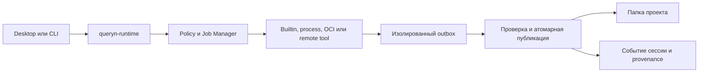

# Обзор архитектуры

Queryn разделена на небольшие репозитории со стабильными зонами ответственности.

Основная модель данных - folder-based проект. Desktop-клиент использует общий
runtime control plane, а runtime использует core для project IO и стабильных
доменов. Расширения объявляют tools, operations, artifact types и runtime через
SDK. AI является опциональным модулем общего runtime.

## Слои

- Формат проекта: файлы, папки, артефакты, сессии и схемы.
- Core libraries: project IO, работа с manifest, validation и общие типы.
- Runtime: jobs, extensions, operations, context, models и agent orchestration.
- Desktop-клиент: Windows/macOS application shell, native integration и UI.
- Extension SDK: manifest, contributions, permissions и protocol contracts.

## Поток выполнения

```text
Desktop / CLI
  -> queryn-runtime
    -> policy + job manager
      -> builtin / process / OCI / remote tool
        -> outbox
      -> artifact validation + atomic publication
    -> session event + provenance
```

Сторонний runtime не получает прямой доступ на запись в папку проекта. Он
получает материализованные inputs и возвращает artifact candidates.

## Сквозные архитектурные контракты

- [Среды исполнения и зависимости инструментов](./tool-runtime-dependencies.md)
  определяют самодостаточную поставку, совместимость, подготовку и удаление.
- [Просмотрщик материалов](./material-viewers.md) определяет единый host,
  встроенные адаптеры, безопасный fallback и будущих поставщиков просмотра.
- [Ошибки, журналы и диагностика](./errors-and-diagnostics.md) определяют
  структурированные причины, корреляцию между процессами и безопасный экспорт.

Эти контракты пересекают границы репозиториев. Публичная схема сначала
фиксируется в `queryn-spec`, общая доменная семантика размещается в
`queryn-core`, runtime владеет исполнением, а desktop отвечает за
пользовательское взаимодействие.

## Пилот Mermaid: запрос к runtime


