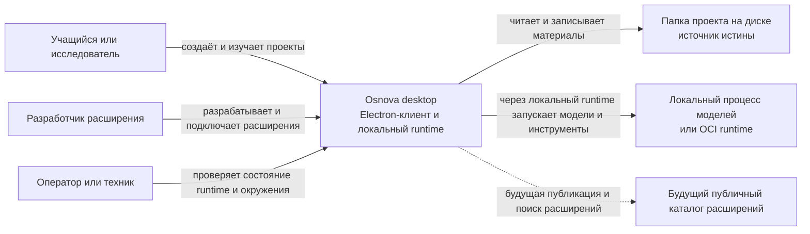
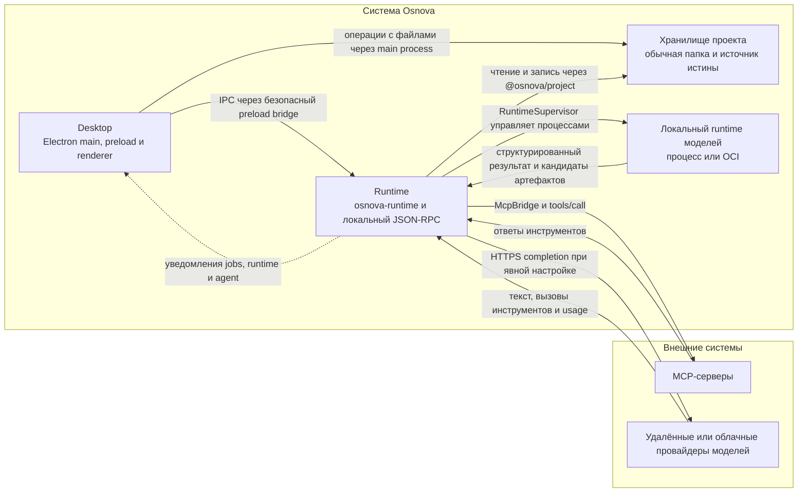
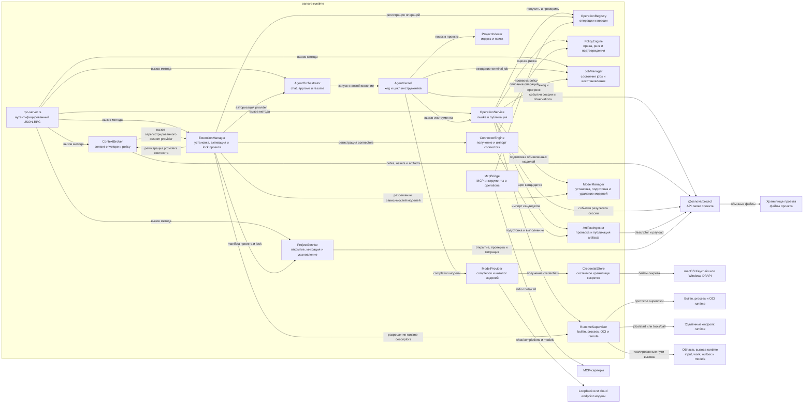
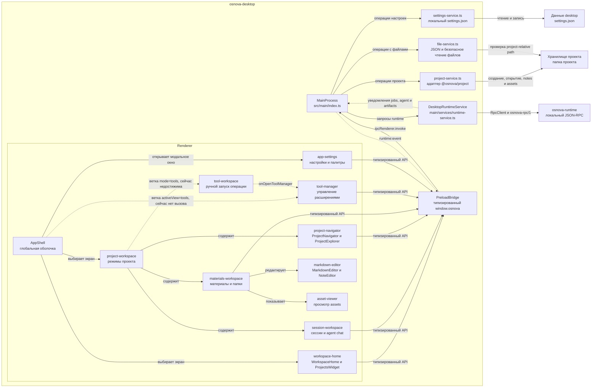
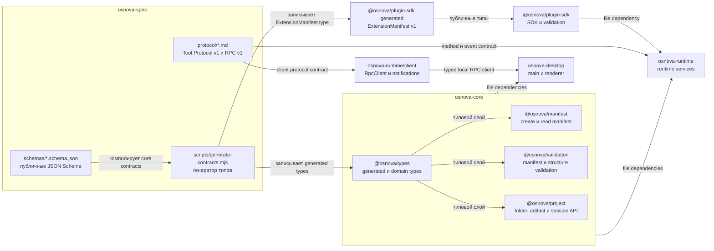

# Системная архитектура

Эта страница фиксирует архитектурные границы Osnova на уровне C4. Диаграммы
сверены с исходниками `osnova-runtime` и `osnova-desktop` на текущем срезе
репозиториев. Mermaid является каноническим форматом диаграмм.

Проект остаётся обычной папкой на диске. `osnova.json`, пользовательские
материалы и переносимые результаты живут в папке проекта. Локальный runtime
хранит производное состояние отдельно и не становится источником истины.

## C1. Контекст системы {#c1-context}

Диаграмма показывает участников и внешние системы, с которыми взаимодействует
продукт. Локальный runtime входит в системную границу продукта, а будущий
публичный каталог показан пунктиром, потому что текущая реализация его не
использует.

`ExtensionDeveloper` публикует пакет расширения через локальный интерфейс
установки. Доверие к пакету и его permissions проверяются локальным runtime.
Текущий продукт не требует сетевого каталога для создания, чтения или
переноса проекта.

В текущем desktop-пути локальный пакет устанавливается через путь для разработки,
допускающий неподписанный пакет, а подключение передаёт расширению весь
объявленный набор permissions. Гранулярный выбор разрешений и подписанный
каталог остаются целевым усилением.

## C2. Контейнеры Osnova {#c2-containers}

Внутри системной границы находятся четыре контейнера. `osnova-spec`,
`osnova-core` и `osnova-plugin-sdk` являются контрактами и библиотеками сборки,
а не исполняемыми контейнерами Osnova, поэтому на этом уровне они не показаны.
MCP-серверы и внешние провайдеры моделей находятся за границей системы.

`Desktop` создаёт процесс `osnova-runtime` при первом запросе к
`DesktopRuntimeService`. Связь использует случайный Unix socket на macOS или
named pipe на Windows и bearer token из стартового дескриптора. `ProjectStorage`
доступен desktop через main process, а runtime получает тот же folder API через
core-пакет.

`Local model runtime` означает локальный процесс или границу выполнения OCI,
которым управляет `RuntimeSupervisor`. Провайдер модели может быть локальным
HTTP endpoint на loopback или внешним HTTPS endpoint. Внешний endpoint всегда
остаётся отдельным провайдером, а выбор получателя cloud проходит через policy.

## C3. Компоненты runtime {#c3-runtime-components}

Компоненты ниже соответствуют классам и модулям `osnova-runtime/src`. Точкой
входа служит `OsnovaRuntime` в `runtime.ts`. `rpc-server.ts` вызывает
публичные методы runtime, а остальные компоненты сохраняют правила и состояние
в рамках локального процесса.

`OperationService` является единой точкой запуска операции. Он проверяет
входные данные, допустимые artifact inputs и policy, создаёт `JobDescriptor`,
передаёт вызов `RuntimeSupervisor`, а затем отдаёт candidate outputs
`ArtifactIngestor`. При публикации core-пакет сначала проверяет paths, MIME,
размер и hash, после чего выполняет staging и атомарный rename.

`JobManager` персистит производные записи jobs в runtime data root. После
перезапуска jobs со статусом `queued` или `running` становятся `interrupted`.
Состояние проекта не зависит от этих записей и остаётся в папке проекта.

`AgentOrchestrator` проверяет провайдера и передаёт модель-driven цикл
`AgentKernel`. Kernel пишет видимые `tool-call` и `observation` события в
session log, ждёт terminal job и при необходимости возвращает статус
`waiting-approval`.

В текущем `agent.chat` `AgentKernel` не вызывает `ContextBroker`. Он получает
историю сессии и работает через доступные project tools, включая поиск, чтение
и разрешение артефакта. `ContextBroker` вызывается отдельными методами
`context.preview` и `context.resolve` через RPC или CLI, а custom provider
подключается через зарегистрированный callback `ExtensionManager`.

`ContextBroker` строит envelope из project materials, применяет режимы
`none`, `automatic`, `declarative` и `custom`, ограничивает бюджет и пересекает
допустимых получателей с чувствительностью материала. `ProjectIndexer` хранит
производный SQLite FTS5 или portable index в `.osnova/index`.

`ExtensionManager` проверяет пакет, регистрирует его операции и runtime
descriptors, а при подключении к проекту обновляет manifest requirement,
производный lock и локальные grants. `McpBridge` использует ту же operation и
risk machinery для подключённых MCP tools.

## C3. Компоненты desktop {#c3-desktop-components}

Сервисная граница desktop состоит ровно из четырёх фактических main-сервисов:
`runtime-service.ts`, `project-service.ts`, `settings-service.ts` и
`file-service.ts`. Отдельных `plugin-service` и `ai-service` в исходниках нет.
Плагины и агент вызываются через runtime RPC.

`preload/index.ts` публикует узкий API `window.osnova`. Renderer не получает
доступ к Node или Electron API. Обработчик `handle` в main сначала проверяет
доверенный frame, затем переводит project id в канонический путь, выполняет
операцию и рекурсивно заменяет `projectPath` в ответах на `projectId`.

`DesktopRuntimeService` лениво запускает `osnova-runtime` с командой `serve`,
читает из stdout address и token, создаёт `RpcClient` и пересылает уведомления
`job.changed`, `approval.required`, `runtime.changed`, `artifact.published`,
`agent.activity` и `agent.output.delta` в renderer.

`ToolWorkspace` и ветка `activeView=tools` существуют в исходниках, однако
`ProjectNavigator` сейчас переключается только между `sessions` и `materials`
и не вызывает `onModeChange("tools")`. Поэтому ручной запуск операции и переход
в `ToolManager` показаны пунктиром как недостижимые из текущего интерфейса.

## Контракты и зависимости {#contracts-and-dependencies}

Эта диаграмма не является C4-уровнем. Она показывает поток схем и реальные
зависимости пакетов. Генератор контрактов пишет типы отдельно в core и SDK,
после чего runtime и desktop используют узкие публичные API.

Карта генерации определена в `osnova-spec/scripts/generate-contracts.mjs`.
Контракты проекта, artifacts, relations, sessions, session events, context,
совместимая схема agent plan и jobs становятся generated типами в
`@osnova/types`. Схема agent plan является остатком контракта и не означает,
что текущий runtime создаёт или исполняет отдельный `AgentPlan`. Контракт
Extension Manifest v1 генерируется в `@osnova/plugin-sdk`.

Runtime фактически зависит от `@osnova/manifest`, `@osnova/project`,
`@osnova/types`, `@osnova/validation` и `@osnova/plugin-sdk`. Desktop фактически
зависит от core-пакетов и `osnova-runtime`, а `RuntimeClient` скрывает socket
транспорт и bearer token за типизированным запросом.
