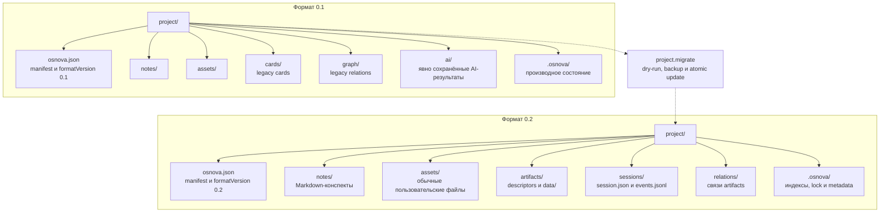

# Спецификация

Авторитетное описание формата проекта находится в репозитории `osnova-spec`.
Эта страница связывает структуру папки, JSON Schema и реализации, которые
используют контракт в workspace.

## Канон формата {#format-canon}

Проект является обычной папкой на диске. `osnova.json` идентифицирует проект и
объявляет `formatVersion`. Пользовательские материалы остаются в `notes/` и
`assets/`. Переносимые результаты и рабочие сессии в формате `0.2` находятся в
`artifacts/`, `sessions/` и `relations/`. `.osnova/` содержит производные
индексы, lock и application metadata и может быть пересобран.

## Диаграмма формата {#format-diagram}

Каноническая структура `0.2` показана рядом с читаемой структурой `0.1`.
Переход выполняется явной операцией `project.migrate` с dry-run и backup
manifest. Обычное открытие проекта не меняет `formatVersion`.

Для `0.1` обязательными для проверки остаются `osnova.json`, `notes/`,
`assets/` и `.osnova/`. Каталоги `cards/`, `graph/` и `ai/` являются legacy
слоем, который остаётся читаемым. В `0.2` новые AI-результаты используют
общую модель `artifacts/`, а существующий `ai/` не удаляется автоматически.

## Сущности, схемы и реализации {#schema-implementation-map}

Генератор `osnova-spec/scripts/generate-contracts.mjs` компилирует публичные
схемы в generated types. Реализация операций с папкой остаётся в
`@osnova/project`, а manifest и validation разделены на узкие core-пакеты.
Оркестрация runtime использует эти типы, но не заменяет их отдельным форматом.

| Сущность | Схема `osnova-spec` | Реализация в `@osnova/*` и runtime |
| --- | --- | --- |
| Manifest проекта | `schemas/osnova.schema.json` | `@osnova/types` `OsnovaManifest`, `@osnova/manifest` `createManifest` и `readManifest`, `@osnova/validation` |
| Версия формата | `$defs/formatVersion` в `osnova.schema.json` | `@osnova/types` `ProjectFormatVersion`, `@osnova/project` `inspectProjectMigration` и `migrateProject` |
| Конспект | `schemas/note-frontmatter.schema.json` | `@osnova/types` `Note` и `NoteSummary`, `@osnova/project` `note.ts` и `frontmatter.ts` |
| Artifact descriptor | `schemas/artifact.schema.json` | `@osnova/types` `ArtifactDescriptor`, `@osnova/project` `publishArtifact`, `registerExistingArtifact`, `readArtifact` |
| Artifact relation | `schemas/artifact-relation.schema.json` | `@osnova/types` `ArtifactRelation`, `@osnova/project` `createArtifactRelation` и `listArtifactRelations` |
| Session descriptor | `schemas/session.schema.json` | `@osnova/types` `SessionDescriptor`, `@osnova/project` `createSession`, `readSession` и `updateSession` |
| Session event | `schemas/session-event.schema.json` | `@osnova/types` `SessionEvent`, `@osnova/project` `appendSessionEvent` и `readSessionEvents` |
| Context envelope | `schemas/context-envelope.schema.json` | `@osnova/types` `ContextEnvelope`, runtime `ContextBroker` и SDK `ContextProviderHandler` |
| Job descriptor | `schemas/job.schema.json` | `@osnova/types` `JobDescriptor`, runtime `JobManager` |
| Agent plan | `schemas/agent-plan.schema.json` | `@osnova/types` `AgentPlan` как совместимая схема; текущий runtime не создаёт и не исполняет отдельный план, а `AgentKernel` ограничивает steps и duration |
| Extension Manifest v1 | `schemas/extension-manifest.schema.json` | generated type в `@osnova/plugin-sdk`, SDK `validateExtensionManifest`, runtime `ExtensionManager` |
| Legacy card | `schemas/card.schema.json` | `@osnova/types` `Card`, отдельного чтения `cards/` в текущем `@osnova/project` нет |
| Legacy relation | `schemas/relation.schema.json` | `@osnova/types` `Relation`, отдельного чтения `graph/` в текущем `@osnova/project` нет |

Схемы `card` и `relation` остаются Draft-контрактами для формата `0.1`.
Текущий `@osnova/project` не публикует и не читает эти legacy-файлы отдельными
операциями. Новые результаты в `0.2` публикуются как `ArtifactDescriptor`.

## Матрица версий {#format-version-matrix}

| Аспект | `0.1` | `0.2` |
| --- | --- | --- |
| Значение `formatVersion` | Разрешено схемой и validation | Разрешено схемой и является текущей максимальной версией в workspace |
| Базовая структура | `osnova.json`, `notes/`, `assets/`, `.osnova/` | `osnova.json`, `notes/`, `assets/`, `artifacts/`, `sessions/`, `relations/`, `.osnova/` |
| Старые учебные данные | `cards/` и `graph/` | Сохраняются как legacy-файлы, отдельной обработки в `@osnova/project` нет, новые связи используют `relations/` и artifacts |
| AI-результаты | Явно сохранённые файлы в `ai/` | Новые результаты в `artifacts/`, существующий `ai/` не удаляется автоматически |
| Сессии | Не входят в обязательную структуру Reborn | `sessions/session.json` и append-only `events.jsonl` |
| Artifact descriptor | Не является обязательным слоем | `artifacts/<id>.json` и payloads в `artifacts/data/` |
| Проверка структуры | `@osnova/validation` требует manifest, notes, assets и `.osnova/` | `@osnova/validation` дополнительно требует artifacts, sessions и relations |
| Создание проекта | Нужно явно выбрать версию, если нужен legacy формат | `@osnova/manifest` и `@osnova/project` создают `0.2` по умолчанию |
| Открытие проекта | Чтение разрешено, формат не меняется | Чтение разрешено, производные каталоги можно восстановить |
| Переход между версиями | Источник явной миграции | Целевая версия текущего migrator |
| Миграция | `project.migrate` возвращает dry-run план | Создаёт недостающие каталоги, сохраняет backup manifest и атомарно обновляет manifest |

Текущая максимальная версия `ProjectFormatVersion` равна `0.2`. Она не равна
`hostVersion` расширений `0.2.0` в `osnova-runtime`: host contract проверяет
совместимость расширения с runtime и является отдельной осью версий.

## Правила переносимости {#portability-rules}

- Папка проекта должна оставаться понятной без `.osnova/`. Индексы и runtime
  caches считаются производными данными.
- `osnova.json.extensions` хранит переносимые требования к расширениям. Выбранные
  версии и integrity находятся в удаляемом `.osnova/extensions/lock.json`.
- Permissions, secrets и сохранённые policy rules не принимаются из папки
  проекта. После переноса локальное доверие выдаётся заново.
- Runtime и внешний инструмент не записывают в папку напрямую. Candidate output
  проходит outbox, проверку и atomic publication через core API.

Подробные поля схем и примеры находятся в
`osnova-spec/specification/project-format.md`, `osnova-spec/schemas/` и
`osnova-spec/examples/`.
